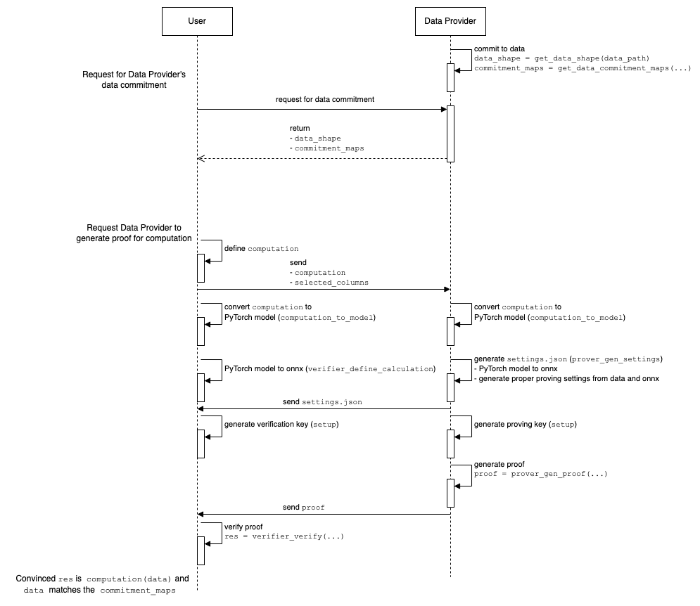

# ZKStats Library

## Overview

ZKStats Library is the core library for ZKStats Platform, designed to generate zero-knowledge (ZK) proofs for statistical functions, leveraging PyTorch and powered by [EZKL](https://github.com/zkonduit/ezkl). This library allows data providers to share statistical result of their dataset with users while still preserving privacy. Users can be convinced the correctness of their computation by verifying a ZK proof without learning the underlying data.

## Supported Statistical Functions
ZKStats Library supports the same set of statistical functions as [Python statistcs module](https://docs.python.org/3/library/statistics.html#averages-and-measures-of-central-location): `mean`, `geometric_mean`, `harmonic_mean`, `median`, `mode`, `pstdev`, `pvariance`, `stdev`, `variance`, `covariance`, `correlation`, and `linear_regression`.

## Installation

Make sure you have Python 3.9 or later installed.

You can install ZKStats library using pip:

```bash
pip install zkstats
```

To hack on the library, you'll need to [install poetry](https://python-poetry.org/docs/#installing-with-pipx) to build the project:

```bash
git@github.com:ZKStats/zk-stats-lib.git
cd zk-stats-lib
poetry install
```

## Getting Started

### Define Your Computation

User computation must be defined as **a function** using ZKStats operations and PyTorch functions. The function signature must be `Callable[[State, list[torch.Tensor]], torch.Tensor]`:

```python
import torch

from zkstats.computation import State

# User-defined computation
def user_computation(s: State, data: list[torch.Tensor]) -> torch.Tensor:
    # Define your computation here
    ...

```
- first argument is a `State` object, which contains the statistical functions that ZKStats supports.
- second argument is a list of PyTorch tensors, the input data. `data[0]` is the first column, `data[1]` is the second column, and so on.


For example, we have two columns of data and we want to compute the mean of the medians of the two columns:

```python
def user_computation(s: State, data: list[torch.Tensor]) -> torch.Tensor:
    # Compute the median of the first column
    median1 = s.median(data[0])
    # Compute the median of the second column
    median2 = s.median(data[1])
    # Compute the mean of the medians
    return s.mean(torch.Tensor([median1, median2]).reshape(1, -1, 1))
```

> NOTE: `reshape` is required for now since input must be in shape `[1, data_size, 1]` for now. It should be addressed in the future

#### Torch Operations
Aside from the ZKStats operations, you can also use PyTorch functions like (`torch.abs`, `torch.max`, ...etc).

<!-- TODO: elaborate -->
**Caveats**: Not all PyTorch functions are supported. For example, `X[X > 0]` is not supported. You should use `torch.where` to do filtering instead. We will have a list for all supported PyTorch functions soon.

#### Data Filtering
You can use `torch.where` to filter data based on a condition.

```python
def user_computation(s: State, data: list[torch.Tensor]) -> torch.Tensor:
    # Compute the mean of the absolute values
    x = data[0]
    condition = x > 20
    # Filter out data that is greater than 20. For the data that is greater than 20, we will use 0.0
    fil_X = torch.where(condition=condition, input=x, other=0.0)
    return s.mean(abs_data)
```
**Caveats**: filtering data using `torch.where` leads to incorrect result from statistical functions. We are working on a solution for this.

### Proof Generation and Verification
The flow between data providers and users is as follows:



#### Data Provider: generate data commitments
Data providers should generate commitments for their dataset beforehand. For a dataset (e.g. a table in a SQL database), there should be a commitment for each column. These commitments are used by users later, to verify the zkp proof and be convinced the computation is done with the correct dataset.

```python
from zkstats.core import get_data_commitment_maps

data_path = "/path/to/your/data.json"
# possible_scales is a list of possible scales for the data to be encoded. For example, here we use [0, 20) as the possible scales, to make sure
possible_scales = list(range(20))
# `commitment_maps` is derived by data providers and shared with users
commitment_maps = get_data_commitment_maps(data_path, possible_scales)
```

When generating a proof, since dataset might contain floating points, data providers need to specify a proper "scale" to encode and decode floating points. Scale is chosen based on the value precision in the dataset and the type of computation. `possible_scales` should cover as many scales as possible and data providers should always use the scales within `possible_scales`, to make sure users can always get the corresponding commitments to verify the proofs.

#### Both: derive PyTorch model from the computation
When a user wants to request a data provider to generate a proof for their defined computation, the user must send the data provider first. Then, both the data provider and the user transform the model to necessary settings, respectively.
```python
from zkstats.core import computation_to_model

_, model = computation_to_model(user_computation)
```

#### Data Provider: generate settings

```python
prover_gen_settings(
    data_path,  # path to the dataset
    selected_columns,  # the column names to be used by the computation
    sel_data_path,  # path to the preprocessed dataset
    prover_model,  # the model generated from the computation
    prover_model_path,  # path to store the generated onnx format of the model
    scale,  # scale to encode and decode floating points
    mode,  # mode to generate settings
    settings_path,  # path to store the generated settings
)
```
#### Data Provider: get proving key
```python
setup(
    prover_model_path,  # path to the onnx format model
    prover_compiled_model_path,  #  path to store the compiled model
    settings_path,  # path to the settings file
    vk_path,  # path to store the generated verification key
    pk_path,  # path to store the generated proving key
)
```

#### User: generate verification key
```python
verifier_define_calculation(
    dummy_data_path,  # path to the dummy data
    selected_columns,  # selected columns
    sel_dummy_data_path,  # path to store the selected dummy data
    verifier_model,  # the model generated from the computation
    verifier_model_path,  # path to store the generated onnx format of the model
)
```
```python
setup(
    verifier_model_path,  # path to the onnx format model
    verifier_compiled_model_path,  #  path to store the compiled model
    settings_path,  # path to the settings file
    vk_path,  # path to store the generated verification key
    pk_path,  # path to store the generated proving key
)
```

#### Data Provider: generate proof

```python
prover_gen_proof(
    # TODO: confirm if it's still required?
    prover_model_path,  # path to the onnx format model
    sel_data_path,  # path to the preprocessed dataset
    witness_path,  # path to store the generated witness file
    prover_compiled_model_path,  # path to store the generated compiled model
    settings_path,  # path to the settings file
    proof_path,  # path to store the generated proof
    pk_path,  # path to the proving key
)
```

#### User: verify proof and get the result
```python
res = verifier_verify(
    proof_path,  # path to the proof
    settings_path,  # path to the settings file
    vk_path,  # path to the verification key
    selected_columns,  # selected columns
    commitment_maps,  # commitment maps
)
print("The result is", res)
```
- **Success**: The result is correct and the computation is verified.
- **Failure Cases**:
    - Computations not within the acceptable error margin.
    - Runtime errors should be reported for further investigation.

## Examples

See our jupyter notebook for [examples](./examples/).

## Benchmarks

See our jupyter notebook for [benchmarks](./benchmark/).

## Note
- We implement using witness approach instead of directly calculating the value in circuit. This sometimes allows us to not calculate stuffs like division or exponential which requires larger scale in settings. (If we don't use larger scale in those cases, the accuracy will be very bad)
- For non-linearity function, larger scale leads to larger lookup table, hence bigger circuit size. Can compare between geomean_OG (implemented in traditional way, instead of witness approach) which is the non-linearity function (p bad with larger scale), and mean_OG which is linear function (p fine with larger scale). Hence, we can say that for linearity func like mean, we can use traditional way, while for non-linear func like geomean, we should use witness approach.
- Dummy data to feed in verifier onnx file needs to have same shape as the private dataset, but can be filled with any value (we just randomize it to be uniform 1-10 with 1 decimal).

